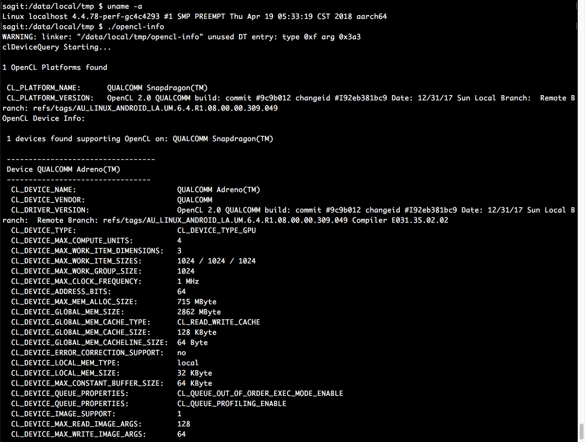

To build this example, execute following commands on HOST machine (i.e. Mac)
```

cd opencl-info
./android_build.sh

```

To execute the compiled binary on Android devices, execute the following commands
on TARGET device (i.e. A rooted Android Phone)
```

cd /data/local/tmp
./opencl-info

```

The program was tested on Snapdragon 835 (Adreno 540 GPU) and MediaTek Helio X20 (Mali T880 GPU).

Modify [libopencl.BUILD](libopencl.BUILD) and [BUILD](opencl-info/BUILD) to switch between the two or add a new OpenCL device
driver from your phone.


